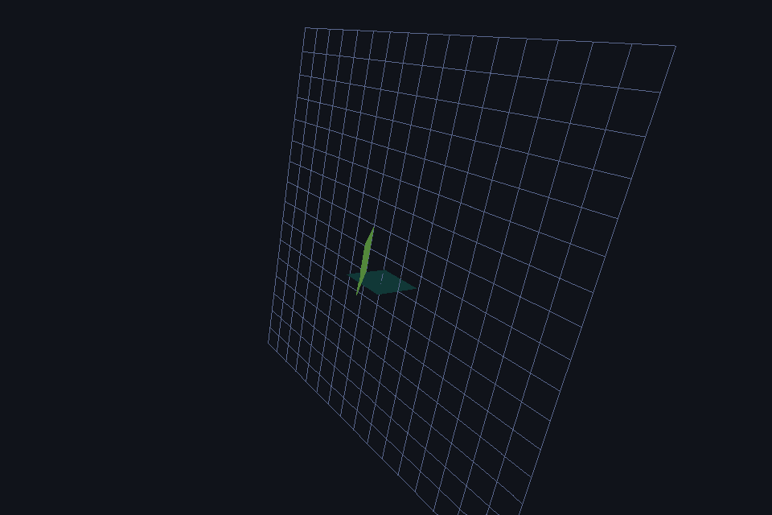

# Silsph Engine

> (C) **SilentStudio** — All Rights Reserved. Proprietary license（私有协议，详见 [LICENSE](LICENSE)）。
> 仓库公开只读，仅 SilentStudio 授权成员可提交。

**自研 3D 图形栈**：C++ OpenGL 引擎 + **纯 C 软件渲染管线**（零第三方依赖）。
目标：OPG(OpenGL) / VK(Vulkan) 同品——无 GPU 机器上的最佳软渲染方案；有 GPU 机器经后端抽象满血加速。



---

## 特性

### Silsph Engine（C++ / OpenGL 3.3 Core）
- 纯 C++ 最小 3D 引擎，**零第三方依赖**
- 手写 Win32 窗口 + WGL 上下文 + 30 个 GL 函数运行时加载器（GLFW 同款方案）
- GLSL shader / VAO-VBO 网格 / 手写 4x4 矩阵（行主序）
- Lambert 光照、背面剔除（CCW）、轨道相机、16x16 地面网格、垂直同步
- 实测 ~1790 FPS（960x640，光照立方体 + 网格）

### Silsph Soft Renderer（纯 C 软件渲染管线）
- **完整管线**：MVP 变换 → 近平面裁剪（Sutherland-Hodgman）→ 背面剔除 → edge-function 光栅化 → 透视校正插值（颜色/深度）→ 深度测试（LESS）→ RGBA8 帧缓冲
- **纹理系统**：RGBA8 2D 纹理（`sp_gen_texture`/`sp_bind_texture`/`sp_texcoord2f`），最近邻/双线性过滤、repeat/clamp 环绕、透视校正 UV 插值、纹素色 × 光照（GL 语义 frag = texel × light）
- **混合/透明**：alpha 混合（`sp_blend`，src_alpha / 1-src_alpha，纹理 alpha 通道）
- **完整视锥裁剪**：6 平面 Sutherland-Hodgman（x±w / y±w / z±w 近远），快速路径免裁剪，视锥外几何零开销
- **正交投影 + 图元扩展**：`sp_ortho`；三角形条带/扇（`SP_TRIANGLE_STRIP/FAN`）、点（`SP_POINTS`）、线带（`SP_LINE_STRIP`）
- **场景图/变换层级**：MODELVIEW 矩阵栈（`sp_push_matrix`/`sp_pop_matrix`，深 16）+ `sp_translate`/`sp_scale`，父子变换（太阳-地球-月亮验证）
- **资源加载**（`silsph_res.h`）：OBJ 模型（`sp_load_obj`：v/vt/vn/f、四边形拆分、材质名）+ BMP 纹理（`sp_load_texture_bmp` 24/32bpp）——零依赖
- **拾取（picking）**：ID 缓冲（`sp_load_id`/`sp_pick_id`/`SP_ID` 清除标志），深度遮挡语义正确；demo 窗口左键点击拾取物体
- **画质控制**：深度测试 / 背面剔除开关（`sp_depth_test` / `sp_cull_face`）
- **帧率控制**：限速器实测 60→59.5 FPS、30→29.7 FPS（`sp_sleep_ms`）
- **硬件信息**：CPU 品牌/核心/主频、内存、GPU 名称/显存、OS 版本（`sp_get_sysinfo`，纯系统 API）
- 即时模式 API（`sp_begin / sp_vertex3f / sp_end`），三角形 + 线段
- **确定性渲染**：无驱动可崩、每帧可复现（可作回归基准）——无 GPU 机器（服务器/CI/虚拟机/老机型）上的最佳选择

## 架构

```
┌─────────────────────────────────────────────┐
│ 应用（demo_soft / crop_test / perf_soft）     │
├─────────────────────────────────────────────┤
│ Silsph Soft Renderer API（silsph_soft.h）    │  ← 自研 API（OPG/VK 同品的第一步）
│  ├ 数学：行主序 4x4 矩阵（列向量约定）        │
│  ├ 图元：三角形 / 线段                       │
│  ├ 裁剪：近平面（clip 空间 z+w>=0）           │
│  ├ 光栅化：edge-function + 重心 + 透视校正    │
│  └ 帧缓冲：RGBA8 + 深度缓冲 → BMP            │
├─────────────────────────────────────────────┤
│ 平台层（#ifdef 隔离，零第三方依赖）           │
│  ├ Windows：注册表 + 系统 API + QPC/Sleep    │
│  ├ Linux：/proc + /sys/class/drm + clock     │
│  └ macOS：sysctl + clock_gettime             │
└─────────────────────────────────────────────┘
```

| 目录 | 内容 |
|---|---|
| `src/` | C++ GL 引擎（Win32 + OpenGL 3.3 Core，独立 demo：`silsph_demo_gl.exe`） |
| `soft/` | 纯 C 软件渲染管线（`silsph_soft.c` 单文件核心，~13KB） |
| `docs/` | 截图 / 文档 |

## 快速开始

**Windows**（需 w64devkit / MinGW gcc）：
```
soft\build.ps1
soft\demo_soft.exe             # 默认：实时动画窗口（立方体自转 + 轨道相机，标题栏 FPS，ESC 退出）
soft\demo_soft.exe --info      # 硬件信息 + 帧率/画质矩阵 + 帧限速（控制台）
soft\demo_soft.exe --frames    # 输出 6 帧 BMP 画质证据（控制台）
soft\crop_test.exe             # 近平面裁剪验证
soft\perf_soft.exe             # 性能基准
```
主目录 `silsph_demo.exe` 即软渲染 demo（窗口模式）；旧 GL 版为 `silsph_demo_gl.exe`。

**Linux / macOS**（gcc/clang）：
```
sh soft/build.sh        # 产物 libsilsph_soft.so / .dylib + demo_soft
./soft/demo_soft
```

## 性能基准（960x640，单线程，-O2）

| 场景 | 结果 |
|---|---|
| demo 立方体（12 三角形） | 0.46 ms/帧（≈2184 FPS 等效） |
| 全屏三角形（~61 万像素） | 7.7 ms/帧，**~79 M像素/s**（含深度测试+透视校正插值） |
| 300 随机三角形重度 overdraw | 全开 35.6 ms / 剔除关 44.0 ms（剔除省 19%） |

优化路线：SIMD（SSE/AVX2）→ 多线程分块光栅化 → 块式遍历 + 提前深度，预期 30~50×。

## 跨平台状态

- 核心管线（矩阵/光栅化/裁剪/深度/插值）：纯 C11，三平台一致
- 平台层：计时/睡眠、硬件信息三平台实现（Windows 已实测；Linux/macOS 分支已写好，待真机验证）
- 构建：`build.ps1`（Windows）/ `build.sh`（Linux/macOS）

## 路线图

三档完整规划见 [ROADMAP.md](ROADMAP.md)：编辑器可用（最急）→ 真游戏引擎 → 生产级成熟。

- [x] 渲染管线核心（光栅化/深度/透视校正/背面剔除/线段）
- [x] 近平面裁剪（Sutherland-Hodgman，clip 空间 z+w>=0）
- [x] 画质/帧率控制、硬件信息（三平台）、跨平台构建
- [ ] **纹理系统**（进行中）→ 混合/透明 → 视锥裁剪 → 场景图 → 资源加载 → 拾取/Gizmo → 离屏渲染 → FFI 绑定
- [ ] SIMD 向量化 + 多线程分块光栅化
- [ ] 数学库 Rust 化
- [ ] GPU 后端抽象（VK 优先，软渲染兜底——"统一 API + 多后端"）

## 技术笔记（GL 引擎踩坑记录）

- GL 3.3 Core 上下文：`wglCreateContextAttribsARB`，`WGL_CONTEXT_CORE_PROFILE_BIT_ARB = 0x1`
- GL 1.1 核心函数（glViewport/glClear/glDrawElements）直接链 opengl32.dll，**不要**用 wglGetProcAddress
- 2.0+ 函数在 3.x context current 后用 wglGetProcAddress 加载
- 行主序 + 列向量的透视矩阵：`m[11]=B`、`m[14]=-1`（与行向量约定的 C++ 引擎相反，勿混用）
- 近平面裁剪必须裁 `z+w>=0` 平面而非 `w=0`：交点 w≈0 会投影到 ±1e6，edge function 浮点精度崩溃

## 许可

(C) **SilentStudio** — All Rights Reserved. Proprietary license. 详见 [LICENSE](LICENSE)。
